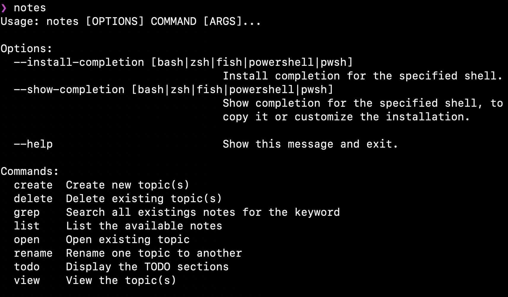

# Take Notes

Command Line notes manager powered by the `typer` python package. Also used `rich` to display tables in the command line.

## Quick Start

This package can be installed with pip by running `pip install .` in the project directory.  

With a successful install, the `notes` command will now be available. Type `notes` to begin and get prompted with following information: 

  

The following commands are available: `create`, `delete`, `grep`, `list`, `open` `rename`, `todo`, `view`

## File Management

All notes are stored as `.txt` files in the hidden `.notes` folder off of the home directory.

## TODO
- Allow do switch the editor (default is vim)
