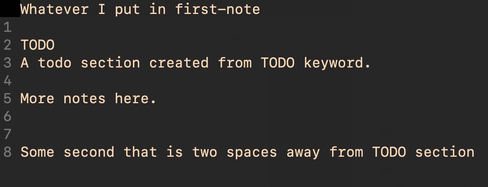

# Take Notes

Command Line notes manager powered by the `typer` python package. Also used `rich` to display tables in the command line.

## Quick Start

This package can be installed with pip by running `pip install .` in the project directory.  

With a successful install, the `notes` command will now be available. Type `notes` to begin and get prompted with following information:

<p align="center">
  
</p>

Create your first note:
```zsh
>>> notes create first-note
The note first-note was created.

>>> notes list
┏━━━━━━━━━━━━━━━━━┓
┃ Available Notes ┃
┡━━━━━━━━━━━━━━━━━┩
│ first-note      │
└─────────────────┘

>>> notes open first-note
💬 Opening first-note text file in vim

>>> notes view first-note
┏━━━━━━━━━━━━┳━━━━━━━━━━━━━━━━━━━━━━━━━━━━━━┓
┃ Topic      ┃ First 5 lines                ┃
┡━━━━━━━━━━━━╇━━━━━━━━━━━━━━━━━━━━━━━━━━━━━━┩
│ first-note │ Whatever I put in first-note │
└────────────┴──────────────────────────────┘
What note do you want to open? [exit]:

```

## `todo` Command

The `notes todo` command searches all files for the keyword `TODO`. The table returned contains all following lines either until the end of the file or two new lines are created in a row.

```zsh
>>> notes todo
┏━━━━━━━━━━━━┳━━━━━━━━━━━━━━━━━━━━━━━━━━━━━━━━━━━━━━━━━━━┓
┃ Note       ┃ TODO                                      ┃
┡━━━━━━━━━━━━╇━━━━━━━━━━━━━━━━━━━━━━━━━━━━━━━━━━━━━━━━━━━┩
│ first-note │ A todo section created from TODO keyword. │
│            │                                           │
│            │ More notes here.                          │
└────────────┴───────────────────────────────────────────┘
What note do you want to open? [exit]:

```

which is parsed from the file below:

<p align="center">
  
</p>


## File Management

All notes are stored as `.txt` files in the hidden `.notes` folder off of the home directory and are managed via the command line app.


## TODO
- Allow do switch the editor (default is vim)
